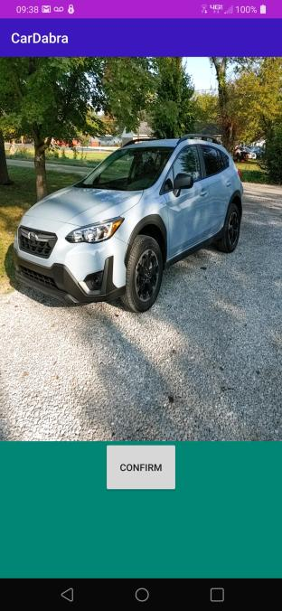
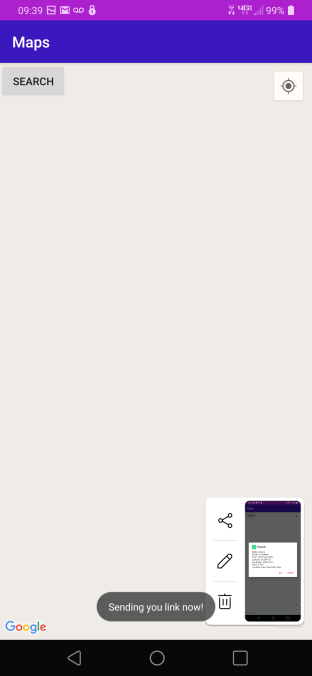
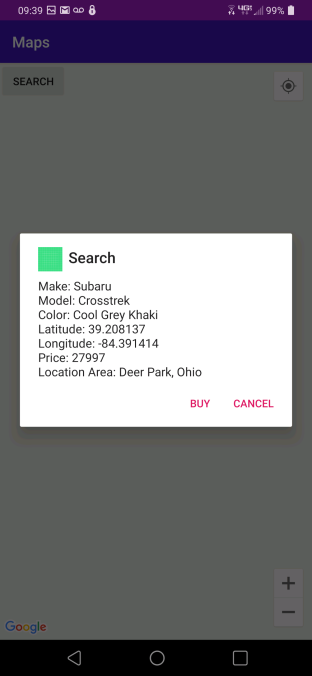

# CarDabra

## Inspiration

Imagine driving through downtown on a Friday night and suddenly a beautiful car rolls past you. Despite being awed by the vehicle, you are unable to identify it. To solve this problem, we decided to create CarDabra, a mobile application that helps identify cars on the road.

## What it does

Similar to Snapchat's Shazam, we decided to move the focus from music to cars. Using a mobile device, you are able to aim your camera at an unknown vehicle and get back the model and make of that car. Not only that, but CarDabra will help you find that car at the cheapest price given transfer fees between one point to another. All of this is done in the palm of your hands.

## How we built it

We used Kotlin, XML, Google Maps API, TensorFlowLite API, and Android Studio to develop the app.

## Challenges we ran into
* A challenge that we had faced was working with git. Some of us had never used git before, so we spent time learning about git commands, branch, and overall version control concepts.
* None of us had ever worked with data modeling and training. We spent quite a bit of time researching how TensorFlow worked and how we could train our own model. 

## Accomplishments that we're proud of
* We were able to piece together multiple screens with different functionalities using Andriod Studios. 
* Upon learning git, we were able to maintain proper version control and kept merge conflicts to a minimum.
* After spending numerous hours, we are proud to incorporate TensorFlow into our codebase. 

## What we learned
* We learned how to create an Android app from scratch.
* We learned how to implement different types of APIs.
* We learned how to use git.
* We learned how to implement data modeling and training.

## What's next?
* Implement an actual database that stores car locations and data.
* Further improve our data modeling by incorporating more images.
* Implement a more advance search that utilizes information aside from transfer fees
* Create additional widgets to provide a better user experience

## Screenshots

On the main screen, the user can instantly take a picture of a vehicle and press confirm.

Once an image is submitted from the camera screen, CarDabra will display that car at the cheapest price given transfer fees

The user can submit confirm the result, and will receive a confirmation. 

